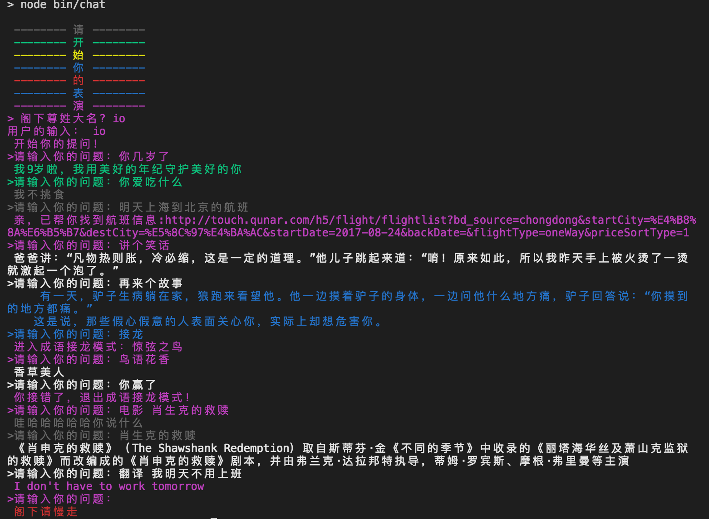

## 问答机器人
node.js完成的命令行问答机器人。

## 安装
> git clone https://github.com/xxs0/node-robot.git

> cd node-robot

> npm start

### 测试

### 感谢
感谢[图灵机器人](http://www.tuling123.com/help/h_cent_webapi.jhtml?nav=doc)提供API
